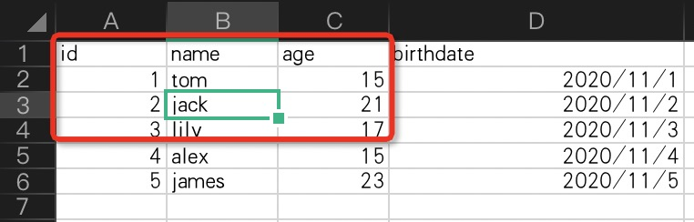
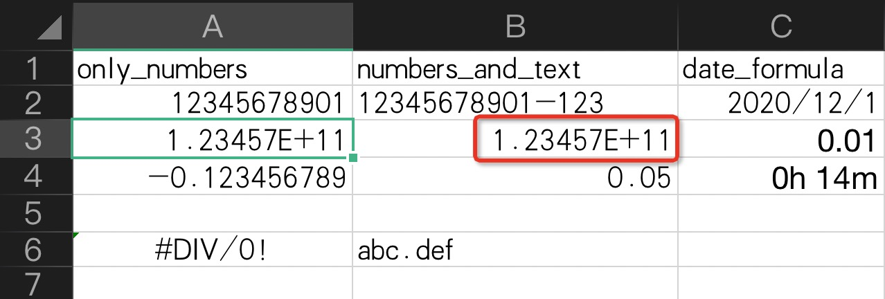
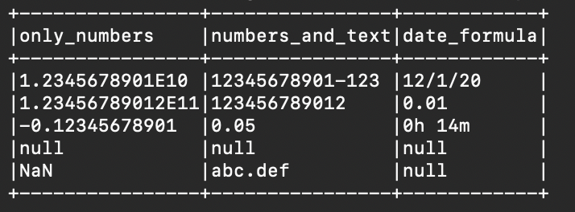
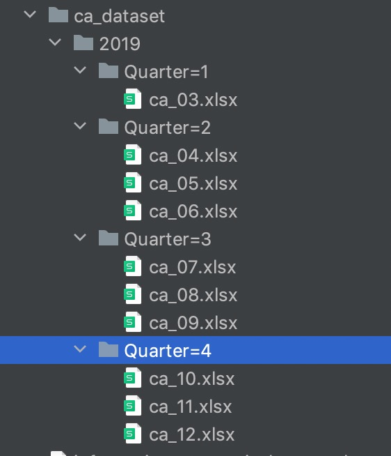

# File Data Ingestion via Excel

### **Features**

Excel data into the hoodie. The third party package sis as follows：

- spark-excel：0.17.1 （require）

【TIPS】

(1) The above library need to be specified through the --jar parameter when submitting the spark application.

(2) If --jar parameter is not specified, you need to package via shading. 


### **Configuration**

| Configuration | Description                                                  | Level             |
| ------------- | ------------------------------------------------------------ | ----------------- |
| --resource    | Excel resource location path.                                | required          |
| --props       | Path to properties file on localfs or dfs.                   | required          |
| --debug       | If you set debug mode, you can see a small amount of data in terminal. | optional（false） |

### *How to configure properties？*

The configuration is divided into the following three parts：

（1）**Read excel extra optional parameter** 

For the external parameters of excel, please refer to ：[spark-excel option configuration](https://github.com/crealytics/spark-excel/blob/main/src/main/scala/com/crealytics/spark/v2/excel/ExcelOptions.scala).

The configuration method in the resource file is '**hoodie.deltastreamer.excel.extra.options.**' splicing with official native parameters.

Some important configurations are as follows：

| Configuration                 | Description                                                  | Default Value                   |
| ----------------------------- | ------------------------------------------------------------ | ------------------------------- |
| header                        | Have header line when reading and writing.<br />**Note**: it is not recommended to set it to false, because it will prevent data from entering the lake. | true                            |
| inferSchema                   | If true, the input data structure is automatically inferred from the data. | false                           |
| dataAddress                   | Data address, default to everything. By default, the reading and writing starts from A1 on the first sheet page | A1                              |
| treatEmptyValuesAsNulls       | Treat empty values as null                                   | true                            |
| setErrorCellsToFallbackValues | Convert the error cell to null . If true, any ERROR cell value (such as #N/A ) will be converted to a zero value of the column data type. | false                           |
| usePlainNumberFormat          | If true, format the cells without rounding and scientific notations. | false                           |
| timestampFormat               | Timestamp format.                                            | yyyy-mm-dd hh:mm:ss[.fffffffff] |
| maxRowsInMemory               | Maximum number of memory operation lines. If this option is set, a streaming reader is used to help with large files. |                                 |
| excerptSize                   | If the structure is set and inferred, it indicates the number of rows from which the structure is inferred. | 10                              |
| workbookPassword              | Workbook password.                                           |                                 |
| ignoreAfterHeader             | Number of rows to ignore after header. Only in reading.      | 0                               |
|                               |                                                              |                                 |
|                               |                                                              |                                 |

（2）**Hoodie optional parameter**

The parameters imported into Hoodie are consistent with the official native parameters. Please refer to the official website.

（3）**transform for data ingestion**

Before the data is imported into Hoodie, simple ETL processing can be carried out through parameters of '**hoodie.deltastreamer.transformer.sql**'. 

Here you can fill in a simple SQL syntax to preprocess the dataset.

### *FAQ*

（1）Why the collected data is all string type？

You can specify the following parameters to automatically infer the data type.

```shell
hoodie.deltastreamer.excel.extra.options.inferSchema=true
```

（2）When an excel file has multiple sheets, can you specify that you need to read the data in the sheet?

For example, there are two sheets, tabelle1 and tabelle2, in the current excel file. Now I just want to collect the data in the sheet named tabelle2. The following parameters can be set：

```shell
hoodie.deltastreamer.excel.extra.options.dataAddress=Tabelle2!A1
```

If the sheet name contains characters such as spaces, it needs to be enclosed in single quotes. Like this below：

```shell
hoodie.deltastreamer.excel.extra.options.dataAddress='Tabelle2'!A1
```

（3）What should I do if I want to intercept part of the data in the sheet data as the collection object?

Examples are as follows：



You can set the parameters like this：

```shell
hoodie.deltastreamer.excel.extra.options.dataAddress=Tabelle2!A1:C4
```

（4）When excel has a number type, excel sometimes performs a certain degree of rounding and scientific notation display. What should I do if I want to collect in the original way?

For example, the following excel is like this：



At this time, the following parameters can be set：

```shell
hoodie.deltastreamer.excel.extra.options.usePlainNumberFormat=true
```

After treatment, it is as follows：



（5）What should I do if the collected excel has a password？

You can set the following parameters：

```shell
hoodie.deltastreamer.excel.extra.options.workbookPassword=...
```

（6）Does it support reading multiple Excel files with consistent data structure？

For example, in the following example, we want to collect files in the partition quarter = 4 directory：



The following parameters can be added during acquisition：

```shell
--resource /.../ca_dataset/2019/Quarter=4/*.xlsx
```